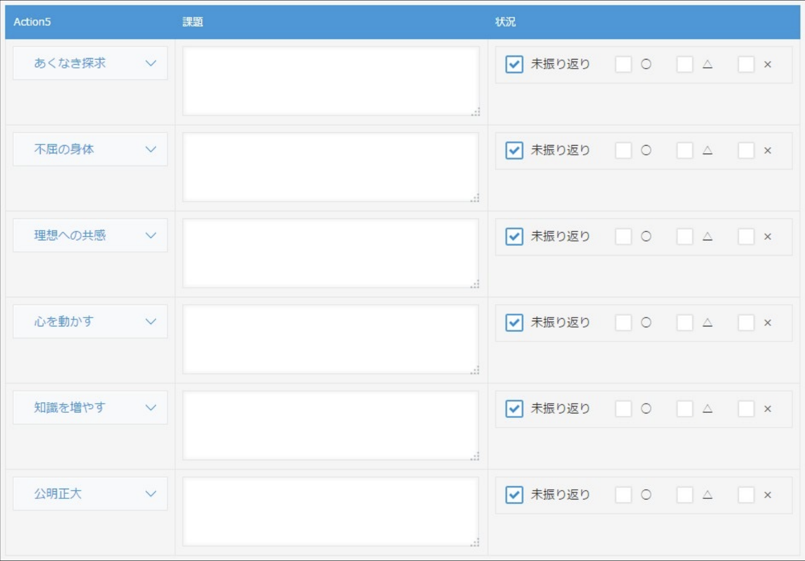

# Task8 Notes

## Original task description

* 前回のJSAPI課題①ではAction5の値は決め打ちで設定していた
* アプリの設定から取得した値で設定できるようにしたい = 決め打ちしたくない
* ドロップダウンに設定された値が過不⾜なく、設定順に表⽰されること
* 使⽤するアプリはJSAPIと同じもの
* アプリ再利⽤で動作確認をすること

## Task description

* Use the [Task_08_kintoneAPI課題用アプリ.zip](Task_08_kintoneAPI課題用アプリ.zip) to build a Kintone App
  * Duplicate the App from the Task 06
* Automatically populate the record's sub-table for each Action5 options (6x)
  * i.e., go through the Action5 drop-down, grab the options, and generate a sub-table row for each option
* Do not hard-code the options as the drop-down field's value may change in the future
* Generate the sub-table rows in the order of the drop-down options

Screenshot of the Customization
* 

## Task steps

1. Create Action5+1(2) app
1. Create event (create.show)
1. As it is to get data from app setting, we will use the method "GET" and URL "/k/v1/app/form/fields.json"
1. Declare request parameter(params) with app id with kintone.app.getId(). reference : [アプリID取得-cybozu developer network](https://developer.cybozu.io/hc/ja/articles/202166300-%E3%82%A2%E3%83%97%E3%83%AAID%E5%8F%96%E5%BE%97)
